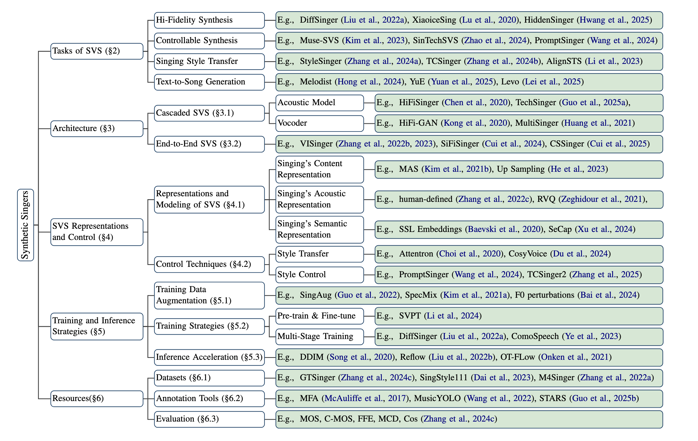
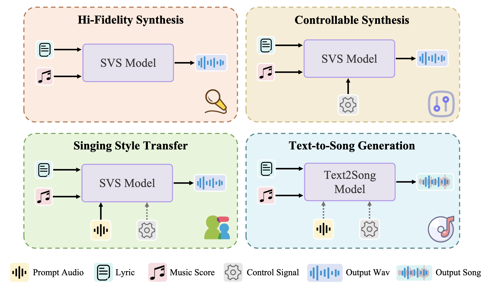
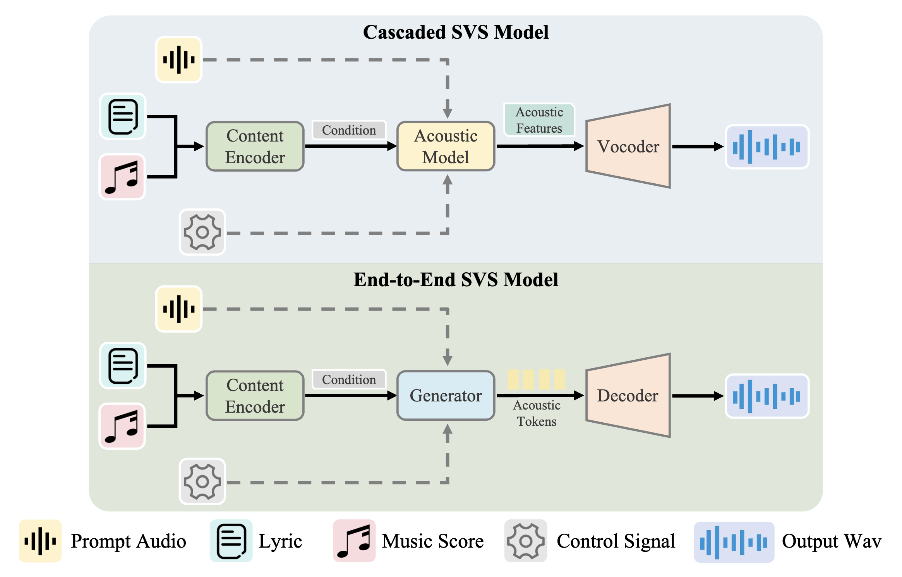

<div align="center">

# Synthetic Singers: A Review of Deep-Learning-based Singing Voice Synthesis Approaches
#### Changhao Pan, Dongyu Yao, Yu Zhang, Wenxiang Guo, Jingyu Lu, Zhiyuan Zhu, Zhou Zhao | Zhejiang University

Official repository and resource list for **Synthetic Singers**, with the paper available on [ACL Anthology](https://aclanthology.org/2025.ijcnlp-long.24/), [arXiv](https://arxiv.org/abs/2601.13910v1), and [GitHub](https://github.com/DaViD-Pigeon/SyntheticSingers).

[](https://arxiv.org/abs/2601.13910v1)
[](https://aclanthology.org/2025.ijcnlp-long.24/)
[](https://github.com/DaViD-Pigeon/SyntheticSingers)

</div>

We introduce **Synthetic Singers**, a comprehensive survey of deep-learning-based singing voice synthesis (SVS). The survey covers major task settings, core model architectures, representative open-source systems, datasets, and practical tools that support SVS research and development. In this repository, we organize the related papers, codebases, and resources referenced throughout the survey.

We hope this repository helps researchers and practitioners quickly navigate the rapidly evolving landscape of singing voice synthesis.

## News

- 2026.01: We release the survey on [arXiv](https://arxiv.org/abs/2601.13910v1) and [GitHub](https://github.com/DaViD-Pigeon/SyntheticSingers).
- 2025.12: Synthetic Singers is accepted by IJCNLP-AACL 2025 (Oral).


# Quick Start

- [Introduction](#introduction)
- [Overall](#overall)
- [Tasks of SVS](#tasks-of-svs)
- [Architectures of SVS Systems](#architectures-of-svs-systems)
- [Publicly Available Singing Voice Synthesis Models](#publicly-available-singing-voice-synthesis-models)
- [Resources in SVS Models](#resources-in-svs-models)
  - [Open-Source Datasets](#open-source-datasets)
  - [Annotation Tools for Singing Data](#annotation-tools-for-singing-data)
- [Citation](#citation)

## Introduction

This repository is the official repository of **Synthetic Singers: A Review of Deep-Learning-based Singing Voice Synthesis Approaches**.

> **Abstract**
>
> Recent progress in deep-learning-based singing voice synthesis has significantly improved synthesis quality, controllability, and expressive capability. At the same time, the field has expanded rapidly across multiple task settings, modeling paradigms, and supporting resources, making it increasingly difficult to form a unified view of the literature. This survey organizes existing work from the perspectives of task formulation and system architecture, and further summarizes representative models, open-source datasets, annotation tools, and practical resources. Our goal is to provide a concise and structured reference for researchers and engineers working on singing voice synthesis.

## Overall

<div align="center">
  
</div>

<div align="center">
  Figure 1: Overall organization of the Synthetic Singers survey.
</div>

## Tasks of SVS

The mainstream singing voice synthesis tasks can be broadly categorized into the following four types:

- **Hi-Fidelity Synthesis:** Focuses on generating high-quality singing voices with clear articulation, natural phrasing, and accurate pitch rendering.
- **Controllable Synthesis:** Aims to preserve synthesis quality while enabling fine-grained control over attributes such as timbre, style, and vocal techniques.
- **Singing Style Transfer:** Given a reference singing prompt, the goal is to generate a synthetic voice that matches the reference in timbre, style, and expression.
- **Text-to-Song Generation:** Targets the joint generation of high-quality singing voices and aligned accompaniment to produce a complete musical piece from text input.

<div align="center">
  
</div>

<div align="center">
  Figure 2: Overview of four representative task categories in singing voice synthesis.
</div>

## Architectures of SVS Systems

We categorize current SVS systems into two groups based on whether the synthesis pipeline explicitly uses a vocoder: **cascaded SVS models** and **end-to-end SVS models**.

<div align="center">
  
</div>

<div align="center">
  Figure 3: SVS models can be organized into cascaded and end-to-end paradigms depending on whether waveform generation relies on a separate vocoder. Dashed lines denote optional components.
</div>

## Publicly Available Singing Voice Synthesis Models

| Model | Link |
| --- | --- |
| DiffSinger | [](https://github.com/MoonInTheRiver/DiffSinger) |
| VISinger (Unofficial implementation) | [](https://github.com/So-Fann/VISinger) |
| VISinger 2 | [](https://github.com/zhangyongmao/VISinger2) |
| VI-SVS | [](https://github.com/PlayVoice/VI-SVS) |
| NNSVS | [](https://github.com/nnsvs/nnsvs) |
| StyleSinger | [](https://github.com/AaronZ345/StyleSinger) |
| TCSinger | [](https://github.com/AaronZ345/TCSinger) |
| TCSinger 2 | [](https://github.com/AaronZ345/TCSinger2) |
| FreeStyler | [](https://github.com/NZqian/RapBank) |
| AlignSTS | [](https://github.com/RickyL-2000/AlignSTS) |
| CoMoSpeech | [](https://github.com/zhenye234/CoMoSpeech) |
| ExpressiveSinger | [](https://github.com/ExpressiveSinger/ExpressiveSinger) |
| TechSinger | [](https://github.com/gwx314/TechSinger) |
| Prompt-Singer | [](https://github.com/cyanbx/Prompt-Singer) |
| HiFiSinger | [](https://github.com/microsoft/muzic) |
| HiFiSinger (Unofficial implementation) | [](https://github.com/CODEJIN/HiFiSinger) |
| ByteSing | [](https://github.com/Noise-Labs/ByteSing-pytorch) |
| WeSinger | [Project Page](https://zzw922cn.github.io/wesinger/) |
| SingGAN | [](https://github.com/Rongjiehuang/SingGAN) |
| UniSinger | [](https://github.com/ViEm-ccy/UniSinger) |
| Learn2Sing 2.0 | [](https://github.com/WelkinYang/Learn2Sing2.0) |
| UniSyn | [](https://github.com/codejiajia/UniSyn) |
| NaturalSpeech 2 | [](https://github.com/lucidrains/naturalspeech2-pytorch) |
| YuE | [](https://github.com/multimodal-art-projection/YuE) |
| SpeechGPT-Gen | [](https://github.com/0nutation/SpeechGPT) |
| InspireMusic | [](https://github.com/FunAudioLLM/InspireMusic) |
| SongGen | [](https://github.com/LiuZH-19/SongGen) |
| DiffRhythm | [](https://github.com/ASLP-lab/DiffRhythm) |
| Levo | [](https://huggingface.co/tencent/SongGeneration) |

<div align="center">
  Table 1: Publicly available singing voice synthesis models and their project links.
</div>

## Resources in SVS Models

In this section, we summarize open-source datasets together with publicly accessible annotation and preprocessing tools that are useful for SVS research.

### Open-Source Datasets

| Name | Link |
| --- | --- |
| MIR-1K | [Zenodo](https://zenodo.org/records/3532216) |
| NUS-48E | [IEEE](https://ieeexplore.ieee.org/document/6694316) |
| VocalSet | [Zenodo](https://zenodo.org/records/1203819) |
| KVT | [IEEE](https://ieeexplore.ieee.org/document/9097399) |
| CSD | [Zenodo](https://zenodo.org/record/4785016#.YLYW6P0QtTa) |
| PJS | [Project Page](https://sites.google.com/site/shinnosuketakamichi/research-topics/pjs_corpus) |
| NHSS | [Project Page](https://hltnus.github.io/NHSSDatabase/download.html) |
| OpenSinger | [Project Page](https://multi-singer.github.io/) |
| Tohoku Kiritan | [Project Page](https://zunko.jp/kiridev/login.php) |
| PopCS | [](https://github.com/MoonInTheRiver/DiffSinger/blob/master/resources/apply_form.md) |
| M4Singer | [](https://github.com/M4Singer/M4Singer) |
| PopBuTFy | [](https://github.com/MoonInTheRiver/NeuralSVB) |
| Opencpop | [Project Page](https://wenet.org.cn/opencpop/) |
| Annotated-VocalSet | [Zenodo](https://zenodo.org/records/7061507) |
| SingStyle111 | [Zenodo](https://zenodo.org/records/10265401) |
| GTSinger | [](https://huggingface.co/datasets/GTSinger/GTSinger) |
| Ace-Opencpop / Ace-KiSing | [](https://github.com/espnet/espnet) |

<div align="center">
  Table 2: Open-source datasets related to singing voice synthesis.
</div>

### Annotation Tools for Singing Data

| Name | Usage | Link |
| --- | --- | --- |
| MFA | Speech-text forced alignment | [Project Page](https://montrealcorpustools.github.io/Montreal-Forced-Aligner/) |
| SOFA | Singing-text forced alignment | [](https://github.com/qiuqiao/SOFA) |
| VOCANO | Vocal note transcription | [](https://github.com/B05901022/VOCANO) |
| MusicYOLO | Music note transcription | [](https://github.com/itec-hust/MusicYOLO) |
| ROSVOT | Vocal note transcription | [](https://github.com/RickyL-2000/ROSVOT) |
| STARS | Unified model for annotation | [](https://github.com/gwx314/STARS) |
| UVR | Voice and accompaniment separation | [Project Page](https://ultimatevocalremover.com/) |
| ClearerVoice | Voice enhancement | [](https://github.com/modelscope/ClearerVoice-Studios) |

<div align="center">
  Table 3: Annotation and preprocessing tools for singing-related data.
</div>

## Citation

If you find this repository useful, please cite the official IJCNLP-AACL 2025 paper:

```bibtex
@inproceedings{pan-etal-2025-synthetic,
  title = "Synthetic Singers: A Review of Deep-Learning-based Singing Voice Synthesis Approaches",
  author = "Pan, Changhao and Yao, Dongyu and Zhang, Yu and Guo, Wenxiang and Lu, Jingyu and Zhu, Zhiyuan and Zhao, Zhou",
  editor = "Inui, Kentaro and Sakti, Sakriani and Wang, Haofen and Wong, Derek F. and Bhattacharyya, Pushpak and Banerjee, Biplab and Ekbal, Asif and Chakraborty, Tanmoy and Singh, Dhirendra Pratap",
  booktitle = "Proceedings of the 14th International Joint Conference on Natural Language Processing and the 4th Conference of the Asia-Pacific Chapter of the Association for Computational Linguistics (Volume 1: Long Papers)",
  month = dec,
  year = "2025",
  address = "Mumbai, India",
  publisher = "The Asian Federation of Natural Language Processing and The Association for Computational Linguistics",
  url = "https://aclanthology.org/2025.ijcnlp-long.24/",
  pages = "396--416",
  isbn = "979-8-89176-298-5"
}
```
