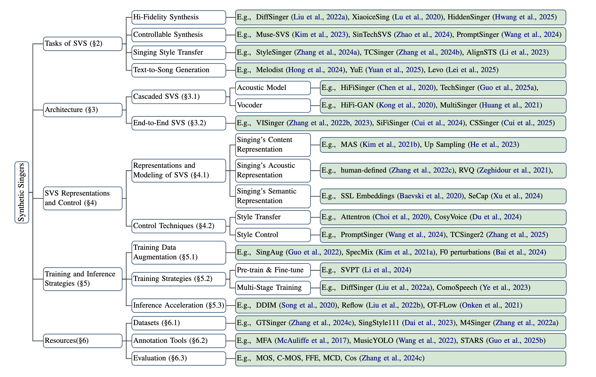
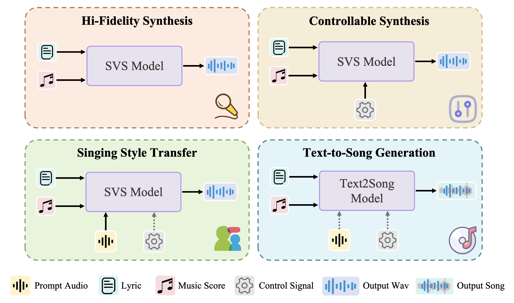
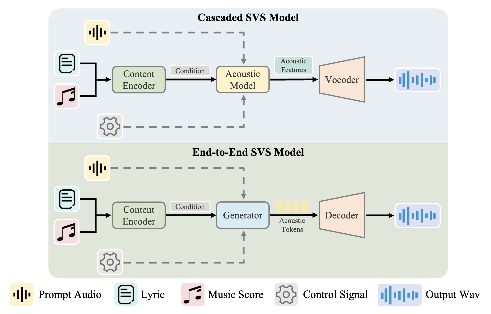

<div align="center">

# Synthetic Singers

## A Review of Deep-Learning-based Singing Voice Synthesis Approaches

**IJCNLP-AACL 2025 · Oral**

Changhao Pan, Dongyu Yao, Yu Zhang, Wenxiang Guo,<br>
Jingyu Lu, Zhiyuan Zhu, Zhou Zhao

Zhejiang University

[](https://arxiv.org/abs/2601.13910v1)
[](https://aclanthology.org/2025.ijcnlp-long.24/)
[](https://github.com/DaViD-Pigeon/SyntheticSingers)

**English** · [简体中文](readme_zh.md) · [한국어](readme_kr.md) · [日本語](readme_ja.md)

**[Models](#publicly-available-singing-voice-synthesis-models) · [Datasets](#open-source-datasets) · [Tools](#annotation-tools-for-singing-data)**

</div>

<a name="quick-start"></a>

## 🚀 Quick Start

This is the official repository for **Synthetic Singers: A Review of Deep-Learning-based Singing Voice Synthesis Approaches**, presented at **IJCNLP-AACL 2025 (Oral)**. Read the paper on [ACL Anthology](https://aclanthology.org/2025.ijcnlp-long.24/) or [arXiv](https://arxiv.org/abs/2601.13910v1).

- **Task taxonomy.** Explore high-fidelity synthesis, controllable synthesis, singing style transfer, and text-to-song generation.
- **System architectures.** Understand the distinction between cascaded and end-to-end SVS systems through the survey diagrams.
- **Representative models.** Browse systems by their primary research focus, with short descriptions and links to available resources.
- **Research resources.** Find singing datasets, corpus statistics, and tools for alignment, transcription, separation, and enhancement.

## Contents

1. [Introduction](#introduction)
2. [Overall](#overall)
3. [Tasks of SVS](#tasks-of-svs)
4. [Architectures of SVS Systems](#architectures-of-svs-systems)
5. [Representative Models and Resources](#publicly-available-singing-voice-synthesis-models)
   - [2026 Highlights (January–October)](#highlights-2026)
   - [Singing Synthesis and Vocoders](#singing-synthesis-and-vocoders)
   - [Style Control and Transfer](#style-control-and-transfer)
   - [Song and Music Generation](#song-and-music-generation)
   - [Related Speech and Singing Models](#related-speech-and-singing-models)
6. [Resources](#resources-in-svs-models)
   - [Available Datasets](#open-source-datasets)
   - [Annotation and Preprocessing Tools](#annotation-tools-for-singing-data)
7. [Citation](#citation)
8. [Contributing](#contributing)
9. [License](#license)
10. [Update](#update)

---

<a name="introduction"></a>

## 📌 Introduction

**Synthetic Singers** brings together the tasks, architectures, models, and data resources used in deep-learning-based singing voice synthesis. The repository accompanies our [survey](https://aclanthology.org/2025.ijcnlp-long.24/) and provides a practical reading guide for researchers and practitioners.

The overview figures introduce the survey's organization and technical perspectives. The resource tables connect these perspectives to individual projects, helping readers locate relevant systems and prepare singing data.

---

<a name="overall"></a>

## 🧭 Overall

<div align="center">
  
  <p><em>Figure 1. Overall organization of the Synthetic Singers survey.</em></p>
</div>

---

<a name="tasks-of-svs"></a>

## 🎯 Tasks of SVS

The survey organizes singing voice synthesis into four task categories. A system may support more than one category.

| Task | Main Goal | What Readers Should Look For |
| --- | --- | --- |
| **High-Fidelity Synthesis** | Generate clear, natural singing that follows the lyrics and melody. | Vocal quality, intelligibility, and pitch accuracy. |
| **Controllable Synthesis** | Adjust singing attributes while preserving synthesis quality. | Control over timbre, style, expression, and vocal techniques. |
| **Singing Style Transfer** | Reproduce the vocal characteristics of a reference performance. | Transfer of timbre, style, and expression from an audio prompt. |
| **Text-to-Song Generation** | Generate a complete song from text input. | Coherent vocals, accompaniment, and musical structure. |

<div align="center">
  
  <p><em>Figure 2. Four representative task categories in singing voice synthesis.</em></p>
</div>

---

<a name="architectures-of-svs-systems"></a>

## 🏗️ Architectures of SVS Systems

We distinguish two architectural paradigms according to whether waveform generation relies on a separate vocoder.

| Paradigm | Synthesis Pipeline | Main Components |
| --- | --- | --- |
| **Cascaded SVS** | Predict acoustic features, then convert them into a waveform. | Acoustic model and a separate vocoder. |
| **End-to-End SVS** | Generate waveforms within an integrated synthesis system. | Jointly modeled conditioning, intermediate representations, and waveform generation. |

<div align="center">
  
  <p><em>Figure 3. Cascaded and end-to-end SVS architectures. Dashed lines denote optional components.</em></p>
</div>

---

<a name="publicly-available-singing-voice-synthesis-models"></a>

## 📚 Representative Models and Resources

Models are grouped by their primary research focus; capabilities may overlap. **Paper** links to a publication or preprint, **Code** to an implementation, **Model** to weights or their download instructions, and **Demo** to examples. **Repo (planned)** marks an official placeholder, not a code or weights release. Only verified resource types are linked; absent links do not prove that no release exists. Unofficial implementations and restricted variants such as **Model (TTS)** are labelled explicitly.

<a name="highlights-2026"></a>

### 2026 Highlights (January–October)

**Scope: 2026-01-01 through 2026-10-03.** These 12 additions span score-driven SVS, speech–singing switching, lyric editing, and full-song generation. Dates below are the first public paper months, not necessarily code/weight release dates. Conference labels are backed by proceedings; other entries are preprints or technical reports. Later revisions of older papers are not counted as new 2026 work.

| Work | First Paper / Venue | Research Focus | Resources |
| --- | --- | --- | --- |
| HeartMuLa | 2026-01 · Preprint / report | Song generation from lyrics, style descriptions, and reference audio; paired with a low-rate music codec. | [Paper](https://arxiv.org/abs/2601.10547v3) · [Code](https://github.com/HeartMuLa/heartlib) · [Model](https://huggingface.co/HeartMuLa/HeartMuLa-oss-3B-happy-new-year) |
| ACE-Step 1.5 | 2026-01 · Preprint / report | Language-model song planning with diffusion rendering, editing, and lightweight personalization. | [Paper](https://arxiv.org/abs/2602.00744v3) · [Code](https://github.com/ace-step/ACE-Step-1.5) · [Model](https://huggingface.co/ACE-Step/Ace-Step1.5) |
| SoulX-Singer | 2026-02 · Preprint / report | Zero-shot singing conditioned on a musical score or melody; Mandarin, English, and Cantonese. | [Paper](https://arxiv.org/abs/2602.07803v2) · [Code](https://github.com/Soul-AILab/SoulX-Singer) · [Model](https://huggingface.co/Soul-AILab/SoulX-Singer) |
| YingMusic-Singer / Plus | 2026-03 · Interspeech 2026 | Melody-preserving lyric editing without manual alignment; the linked implementation is the Plus release. | [Paper](https://www.isca-archive.org/interspeech_2026/hao26_interspeech.html) · [Preprint](https://arxiv.org/abs/2603.24589) · [Code](https://github.com/ASLP-lab/YingMusic-Singer-Plus) · [Model](https://huggingface.co/ASLP-lab/YingMusic-Singer-Plus) |
| UniVocal | 2026-06 · ACL 2026 | Text-controlled speech–singing switching. The official repository still lists code, weights, and SCSBench as planned. | [Paper](https://aclanthology.org/2026.acl-long.1452/) · [Repo (planned)](https://github.com/QwenAudio/FunResearch/tree/main/UniVocal) · [Demo](https://project-univocal-demo.github.io/demo/) |
| UniVoice | 2026-06 · Preprint / report | A shared flow-matching framework for speech and singing, with separate content, melody, and timbre conditioning. | [Paper](https://arxiv.org/abs/2606.05852v1) |
| MeloDISinger | 2026-06 · Interspeech 2026 | Flow-matching infilling for lyric edits while preserving melody, duration, and unedited audio. | [Paper](https://www.isca-archive.org/interspeech_2026/park26k_interspeech.html) · [Preprint](https://arxiv.org/abs/2606.30580v1) · [Demo](https://cottonlove.github.io/MeloDISinger_demo/) |
| LeVo 2 | 2026-06 · Preprint / report | Hierarchical song modeling with vocal/accompaniment streams and a diffusion music codec. | [Paper](https://arxiv.org/abs/2606.30642v1) · [Code](https://github.com/levo-demo/LeVo) · [Model](https://huggingface.co/lglg666/SongGeneration-v2-large) |
| Qwen-Music | 2026-07 · Preprint / report | Melody-CoT planning and flow-matching audio rendering for song generation and covers. | [Paper](https://arxiv.org/abs/2607.11699v3) |
| VocalRender | 2026-07 · Preprint / report | Score-native singing from lyrics, pitch, note values, and tempo using autoregressive diffusion. | [Paper](https://arxiv.org/abs/2607.27768v1) · [Code](https://github.com/pymaster17/VocalRender) · [Model](https://huggingface.co/pymaster/VocalRender) · [Data](https://huggingface.co/datasets/pymaster/CrawlSinger-OS) |
| DiffSynth-Music | 2026-09 · Preprint / report | Audio-conditioned control over beats, vocals, accompaniment, prosody, and reference timbre on ACE-Step. | [Paper](https://arxiv.org/abs/2609.12774v1) · [Code](https://github.com/modelscope/DiffSynth-Studio/tree/main/examples/diffsynth_music) · [Model](https://modelscope.cn/models/DiffSynth-Studio/DiffSynth-Music) |
| YuE2 | 2026-09 · Preprint / report | Editable melody/chord planning followed by full-song audio generation, with zero-shot covers. | [Paper](https://arxiv.org/abs/2609.33757v1) · [Code](https://github.com/multimodal-art-projection/YuE) · [Model](https://huggingface.co/m-a-p/YuE2-3B) |

<a name="singing-synthesis-and-vocoders"></a>

### Singing Synthesis and Vocoders

| Model | Research Focus | Resources |
| --- | --- | --- |
| DiffSinger | Singing synthesis with shallow diffusion. | [Paper](https://arxiv.org/abs/2105.02446) · [Code](https://github.com/MoonInTheRiver/DiffSinger) · [Model](https://github.com/MoonInTheRiver/DiffSinger/releases) |
| VISinger (Unofficial implementation) | End-to-end singing synthesis with variational inference and adversarial learning. | [Paper](https://arxiv.org/abs/2110.08813) · [Code](https://github.com/So-Fann/VISinger) |
| VISinger 2 | End-to-end synthesis enhanced by a digital signal processing synthesizer. | [Paper](https://arxiv.org/abs/2211.02903) · [Code](https://github.com/zhangyongmao/VISinger2) · [Model](https://drive.google.com/file/d/1MgXLQuquPT2qu1__JNF010-tg48N0hZn/view) |
| VI-SVS | Singing synthesis based on VITS. | [Code](https://github.com/PlayVoice/VI-SVS) · [Model](https://github.com/PlayVoice/VI-SVS/releases/tag/0.0.3) |
| NNSVS | A research library for neural singing voice synthesis. | [Paper](https://arxiv.org/abs/2210.15987) · [Code](https://github.com/nnsvs/nnsvs) |
| CoMoSpeech | One-step speech and singing synthesis with a consistency model. | [Paper](https://arxiv.org/abs/2305.06908) · [Code](https://github.com/zhenye234/CoMoSpeech) · [Model (TTS)](https://drive.google.com/drive/folders/1rkbzl9NzS_fKtMubQ7FgSdgt7v8ZuYGk) |
| HiFiSinger | High-fidelity neural singing synthesis; linked from the Muzic research overview. | [Paper](https://arxiv.org/abs/2009.01776) · [Overview](https://github.com/microsoft/muzic) |
| HiFiSinger (Unofficial implementation) | An independent implementation of HiFiSinger. | [Paper](https://arxiv.org/abs/2009.01776) · [Code](https://github.com/CODEJIN/HiFiSinger) |
| ByteSing | Chinese singing synthesis with duration modeling and a WaveRNN vocoder. | [Paper](https://arxiv.org/abs/2004.11012) |
| WeSinger | Singing synthesis with data augmentation and auxiliary losses. | [Paper](https://arxiv.org/abs/2203.10750) · [Demo](https://zzw922cn.github.io/wesinger/) |
| SingGAN | Adversarial waveform generation for high-fidelity singing. | [Paper](https://arxiv.org/abs/2110.07468) · [Demo](https://singgan.github.io/) |
| UniSinger | Unified end-to-end singing synthesis with cross-modality information matching. | [Paper](https://doi.org/10.1145/3581783.3612150) · [Repo (planned)](https://github.com/ViEm-ccy/UniSinger) · [Demo](https://unisinger.github.io/Samples/) |
| Learn2Sing 2.0 | Target-speaker singing synthesis by learning from a singing teacher. | [Paper](https://arxiv.org/abs/2203.16408) · [Code](https://github.com/WelkinYang/Learn2Sing2.0) · [Demo](https://welkinyang.github.io/Learn2Sing2.0/) |
| UniSyn | Unified end-to-end text-to-speech and singing synthesis. | [Paper](https://arxiv.org/abs/2212.01546) |

<a name="style-control-and-transfer"></a>

### Style Control and Transfer

| Model | Research Focus | Resources |
| --- | --- | --- |
| StyleSinger | Style transfer for out-of-domain singing voices. | [Paper](https://arxiv.org/abs/2312.10741) · [Code](https://github.com/AaronZ345/StyleSinger) · [Model](https://huggingface.co/AaronZ345/StyleSinger) |
| TCSinger | Zero-shot singing with style transfer and control at multiple levels. | [Paper](https://aclanthology.org/2024.emnlp-main.117/) · [Code](https://github.com/AaronZ345/TCSinger) · [Model](https://huggingface.co/AaronZ345/TCSinger) |
| TCSinger 2 | Customizable multilingual zero-shot singing synthesis. | [Paper](https://arxiv.org/abs/2505.14910) · [Code](https://github.com/AaronZ345/TCSinger2) |
| FreeStyler | Rap generation; the linked RapBank repository provides data and processing tools. | [Paper](https://arxiv.org/abs/2408.15474) · [Code (data)](https://github.com/NZqian/RapBank) · [Demo](https://nzqian.github.io/Freestyler/) |
| AlignSTS | Speech-to-singing conversion with cross-modal alignment. | [Paper](https://arxiv.org/abs/2305.04476) · [Code](https://github.com/RickyL-2000/AlignSTS) · [Model](https://drive.google.com/file/d/1hKesxqkbrBKC06eYLmlCutPathdJLCK1/view) |
| ExpressiveSinger | Expressive performance control for multilingual, multi-style singing. | [Paper](https://doi.org/10.1145/3664647.3681642) · [Demo](https://expressivesinger.github.io/ExpressiveSinger/) |
| TechSinger | Multilingual singing technique control with flow matching. | [Paper](https://arxiv.org/abs/2502.12572) · [Code](https://github.com/gwx314/TechSinger) · [Model](https://huggingface.co/verstar/TechSinger) |
| Prompt-Singer | Control of singing synthesis through natural-language prompts. | [Paper](https://arxiv.org/abs/2403.11780) · [Code](https://github.com/cyanbx/Prompt-Singer) · [Model](https://huggingface.co/Cyanbox/Prompt-Singer) |

<a name="song-and-music-generation"></a>

### Song and Music Generation

| Model | Research Focus | Resources |
| --- | --- | --- |
| YuE | Lyrics-to-song generation; the linked branch preserves the original YuE release. | [Paper](https://arxiv.org/abs/2503.08638) · [Code](https://github.com/multimodal-art-projection/YuE/tree/YuE-v1) · [Model](https://huggingface.co/m-a-p/YuE-s1-7B-anneal-en-cot) |
| InspireMusic | Music, song, and audio generation toolkit. | [Paper](https://arxiv.org/abs/2503.00084) · [Code](https://github.com/FunAudioLLM/InspireMusic) · [Model (music)](https://modelscope.cn/models/iic/InspireMusic-1.5B-Long) |
| SongGen | Text-to-song generation with a single-stage autoregressive Transformer. | [Paper](https://arxiv.org/abs/2502.13128) · [Code](https://github.com/LiuZH-19/SongGen) · [Model](https://huggingface.co/LiuZH-19/SongGen_mixed_pro) |
| DiffRhythm | End-to-end full-length song generation with latent diffusion. | [Paper](https://arxiv.org/abs/2503.01183) · [Code](https://github.com/ASLP-lab/DiffRhythm) · [Model](https://huggingface.co/ASLP-lab/DiffRhythm-full) |
| Levo | Song generation with vocals and accompaniment. | [Paper](https://arxiv.org/abs/2506.07520) · [Code](https://github.com/levo-demo/LeVo) · [Model](https://huggingface.co/lglg666/SongGeneration-base-new) |

<a name="related-speech-and-singing-models"></a>

### Related Speech and Singing Models

| Model | Research Focus | Resources |
| --- | --- | --- |
| NaturalSpeech 2 (Unofficial implementation) | Diffusion-based speech and singing synthesis; unofficial implementation. | [Paper](https://arxiv.org/abs/2304.09116) · [Code](https://github.com/lucidrains/naturalspeech2-pytorch) |
| SpeechGPT-Gen | Speech generation with chain-of-information modeling. | [Paper](https://arxiv.org/abs/2401.13527) · [Repo (planned)](https://github.com/0nutation/SpeechGPT/tree/main/speechgpt-gen) · [Demo](https://0nutation.github.io/SpeechGPT-Gen.github.io/) |

---

<a name="resources-in-svs-models"></a>

## 📦 Resources

This section collects singing datasets and tools for preparing training and evaluation data.

<a name="open-source-datasets"></a>

### 📊 Available Datasets

**45 datasets and companion resources**, covering SVS training, alignment/transcription, separation, and evaluation. **Data** denotes a released dataset, **Annotations / Metadata** denotes labels or source lists, and **Access** points to acquisition instructions, which may require permission. Paper-only and planned entries are identified explicitly. Language codes: zh = Mandarin, en = English, ja = Japanese, ko = Korean; other multilingual resources give a count where available.

Legacy corpus figures start from [Table 1 of the survey](https://arxiv.org/html/2601.13910v1); linked author releases and dataset papers supply version-specific details and corrections. Durations are approximate. ACE durations are **corpus totals**, and its voice counts describe synthetic timbres. Derived corpora and evaluation subsets overlap: do not sum these rows into a unique-audio total.

[Singing and SVS Training Corpora](#svs-training-corpora) · [Lyrics, Notes, Song Structure and Separation](#alignment-and-separation-data) · [Evaluation Benchmarks and Companion Annotations](#singing-evaluation-benchmarks)

<a name="svs-training-corpora"></a>

#### Singing and SVS Training Corpora

| Dataset | Language / Scale | Coverage and Access | Resources |
| --- | --- | --- | --- |
| NUS-48E | en · 12 singers | 115 min singing + 54 min speech; phoneme boundaries. Paper provides the corpus reference. | [Paper](https://ieeexplore.ieee.org/document/6694316) |
| VocalSet | en · 20 singers · 10.1 h | Singing techniques and vowels across multiple pitches and contexts. | [Data](https://zenodo.org/records/1203819) |
| CSD | ko / en · 100 songs | One singer; two keys per song (200 recordings), MIDI and phoneme/grapheme lyrics. | [Code](https://github.com/emotiontts/emotiontts_open_db/tree/master/Dataset/CSD) · [Data](https://zenodo.org/records/4785016) |
| PJS | ja · 1 singer · 0.5 h | Phoneme-balanced Japanese singing with score and timing resources. | [Paper](https://arxiv.org/abs/2006.02959) · [Data](https://sites.google.com/site/shinnosuketakamichi/research-topics/pjs_corpus) |
| NHSS | en · 10 singers · 7 h | Total includes parallel speech and singing for 100 songs; licence form and email request required. | [Paper](https://arxiv.org/abs/2012.00337) · [Access](https://hltnus.github.io/NHSSDatabase/download.html) |
| OpenSinger | zh · 66 singers · 50 h | Multi-singer Mandarin recordings for singing synthesis and voice conversion. | [Access](https://multi-singer.github.io/) |
| Tohoku Kiritan | ja · 50 songs | Single-singer recordings and score resources; follow the provider’s access terms. | [Access](https://zunko.jp/kiridev/login.php) |
| PopCS | zh · 1 singer · 5.9 h | DiffSinger’s Mandarin corpus; application-based access. | [Paper](https://arxiv.org/abs/2105.02446) · [Access](https://github.com/MoonInTheRiver/DiffSinger/blob/master/resources/apply_form.md) |
| M4Singer | zh · 20 singers · 29.8 h | Manual score, lyric and phoneme annotations; soprano, alto, tenor and bass voices. | [Code](https://github.com/M4Singer/M4Singer) · [Data](https://drive.google.com/file/d/1xC37E59EWRRFFLdG3aJkVqwtLDgtFNqW/view) |
| PopBuTFy | zh / en · 34 singers · 50.8 h | Amateur and professional singing for vocal beautification; access via NeuralSVB. | [Paper](https://arxiv.org/abs/2202.13277) · [Code / Access](https://github.com/MoonInTheRiver/NeuralSVB) |
| Opencpop | zh · 1 singer · 5.2 h | Mandarin pop singing with phoneme/note boundaries; download instructions sent after form submission. | [Paper](https://arxiv.org/abs/2201.07429) · [Access](https://wenet-e2e.github.io/opencpop/download/) |
| SingStyle111 | 3 languages · 8 singers · 12.8 h | Multilingual singing styles; Zenodo record has restricted access. | [Access](https://zenodo.org/records/10265401) |
| GTSinger | 9 languages · 20 singers · 80.6 h | Technique-labelled multilingual singing, paired speech and score annotations. | [Paper](https://arxiv.org/abs/2409.13832) · [Code](https://github.com/GTSinger/GTSinger) · [Data](https://huggingface.co/datasets/AaronZ345/GTSinger) |
| ACE-Opencpop | zh · 30 voices · 128.9 h | Synthetic voices, not 30 human singers. Total duration; 4.3 h is the per-voice average. | [Paper](https://arxiv.org/abs/2401.17619v2) · [Data](https://huggingface.co/datasets/espnet/ace-opencpop-segments) |
| ACE-KiSing | zh / en · 34 voices · 32.5 h | Synthetic augmentation; total duration, versus about 1 h per voice. | [Paper](https://arxiv.org/abs/2401.17619v2) · [Data](https://huggingface.co/datasets/espnet/ace-kising-segments) |
| KiSing-v1 | zh · 1 singer · 0.7 h | 14-song original recorded corpus; distinct from synthetic ACE-KiSing. Reference describes both. | [Reference](https://arxiv.org/abs/2401.17619v2) |
| JVS-MuSiC | ja · 100 singers · 2.3 h | Two songs per singer, with reading speech available in the related JVS corpus. | [Paper](https://arxiv.org/abs/2001.07044) · [Data](https://sites.google.com/site/shinnosuketakamichi/research-topics/jvs_music) |
| JSUT-song | ja · 27 songs | Single-singer nursery songs with musical scores and phoneme alignment resources. | [Data](https://sites.google.com/site/shinnosuketakamichi/publication/jsut-song) |
| NIT-SONG070-F001 | ja · 31 songs | Single-singer Japanese corpus used in HTS/Sinsy research; see the linked comparative reference. | [Reference](https://arxiv.org/abs/2401.17619v2) |
| CrawlSinger-OS | zh · 2,317 h · 776k segments | Synthetic + real audio with lyrics, pitch, note values and tempo; derived sources overlap other rows. | [Paper](https://arxiv.org/abs/2607.27768v1) · [Code](https://github.com/pymaster17/VocalRender) · [Data](https://huggingface.co/datasets/pymaster/CrawlSinger-OS) |
| OpenSongSong | zh · 29.9 h | SongCi singing corpus described in SongSong (AAAI 2025); downloadable release not verified. | [Paper](https://ojs.aaai.org/index.php/AAAI/article/view/34820) · [Demo](https://zcli-charlie.github.io/projects/songsong/) |
| SingNet | Multilingual · ~3,000 h | In-the-wild singing corpus and processing pipeline described in the paper; public audio download not verified. | [Paper](https://arxiv.org/abs/2505.09325) |

<a name="alignment-and-separation-data"></a>

#### Lyrics, Notes, Song Structure and Separation

| Dataset | Language / Scale | Coverage and Access | Resources |
| --- | --- | --- | --- |
| KVT | ko · 114 singers · 18.9 h | Vocal timbre/style tags; the paper describes annotations and source links, without redistributing audio. | [Paper](https://ieeexplore.ieee.org/document/9097399) |
| MIR-1K | zh · 19 singers · 2.2 h | 1,000 vocal/accompaniment excerpts for singing separation and pitch research. | [Data](https://zenodo.org/records/3532216) |
| DAMP-MVP / Sing! 300×30×2 | Multilingual | Karaoke performances, lyrics and metadata; audio requires access permission. | [Access](https://zenodo.org/records/2747436) |
| DSing | en · DAMP subset | Lyrics-transcription segmentation and recipes; obtain source audio through DAMP permission. | [Code / Annotations](https://github.com/groadabike/Kaldi-Dsing-task) · [Access](https://zenodo.org/records/2747436) |
| DALI | Multilingual (v1) · 5358 songs | Aligned lyrics and vocal notes; annotations and audio-retrieval code, rather than bundled audio. | [Paper](https://arxiv.org/abs/1906.10606) · [Code / Annotations](https://github.com/gabolsgabs/DALI) |
| RapBank | 84 languages · 5,586 h (collected) | Rap video IDs and data-processing pipeline; the reported collection size is not a hosted audio download. | [Paper](https://arxiv.org/abs/2408.15474) · [Code / Metadata](https://github.com/NZqian/RapBank) |
| MIR-ST500 | Pop · 500 songs | Vocal-note annotations and source URLs; copyrighted audio is not redistributed. | [Paper](https://ieeexplore.ieee.org/document/9414601) · [Code / Annotations](https://github.com/york135/singing_transcription_ICASSP2021) |
| JamendoLyrics MultiLang | en / fr / de / es · 79 songs | Audio with word- and line-level lyric timestamps; current Hugging Face release. | [Paper](https://arxiv.org/abs/2306.07744) · [Data](https://huggingface.co/datasets/jamendolyrics/jamendolyrics) |
| MuChin 1k / v2-6066 | zh (v2) · 6066 songs | Music descriptions, structure and lyrics. Follow v2 guidance on duplicate annotations and lyric timestamps. | [Paper](https://www.ijcai.org/proceedings/2024/0860.pdf) · [Code](https://github.com/CarlWangChina/MuChin-V2-6066) · [Data](https://huggingface.co/datasets/karl-wang/MuChin-v2-6066) |
| SongFormDB | Multilingual · >10k tracks | Song-structure labels across four subsets; source-dependent audio reconstruction instructions. | [Paper](https://arxiv.org/abs/2510.02797) · [Data](https://huggingface.co/datasets/ASLP-lab/SongFormDB) |
| MUSDB18 / MUSDB18-HQ | Multilingual · 150 songs | ~10 h; vocal, bass, drums and other stems. HQ is a higher-quality version of the same tracks. | [Access](https://sigsep.github.io/datasets/musdb.html) · [Data (HQ)](https://zenodo.org/records/3338373) |
| DSD100 | Multilingual · 100 songs | Vocal/accompaniment separation stems; also included in MUSDB18. | [Data](https://sigsep.github.io/datasets/dsd100.html) |
| MedleyDB 1.0 / 2.0 | 122 + 74 multitracks | Instrument/vocal stems and melody annotations; includes instrumental tracks; audio access by request. | [Access / Annotations](https://medleydb.weebly.com/) |
| jaCappella v2 | ja · 50 songs | Six isolated vocal parts per song, plus PDF/MusicXML scores; provider-specific terms. | [Paper](https://arxiv.org/abs/2211.16028) · [Data](https://huggingface.co/datasets/jaCappella/jaCappella) |

<a name="singing-evaluation-benchmarks"></a>

#### Evaluation Benchmarks and Companion Annotations

| Dataset | Language / Scale | Coverage and Access | Resources |
| --- | --- | --- | --- |
| Annotated-VocalSet | VocalSet companion | Additional annotations for VocalSet; not an independent audio corpus. | [Annotations](https://zenodo.org/records/7061507) |
| SoulX-Singer-Eval | zh / en · 100 clips · 50 singers | Cross-domain zero-shot SVS evaluation; repository also distributes an 802-sample GMO-SVS subset. | [Paper](https://arxiv.org/abs/2602.07803v2) · [Code](https://github.com/Soul-AILab/SoulX-Singer-Eval) · [Data](https://huggingface.co/datasets/Soul-AILab/SoulX-Singer-Eval-Dataset) |
| LyricEditBench | zh / en · 7,200 cases | Six melody-preserving lyric-edit tasks derived from GTSinger; overlaps its source recordings. | [Paper](https://arxiv.org/abs/2603.24589) · [Code](https://github.com/ASLP-lab/YingMusic-Singer-Plus) · [Data](https://huggingface.co/datasets/ASLP-lab/LyricEditBench) |
| SCSBench | UniVocal · ACL 2026 | Speech–singing switching benchmark; announced, but official data release remains planned. | [Paper](https://aclanthology.org/2026.acl-long.1452/) · [Repo (planned)](https://github.com/QwenAudio/FunResearch/tree/main/UniVocal) |
| MMGenre | zh · 3,152 pairs · 4.36 h | Synthetic singing/audio-score pairs: 148 songs, 10 genres and 26 subgenres in the released card. | [Paper](https://arxiv.org/abs/2607.06986) · [Code](https://github.com/FengJin1117/mmgenre) · [Data](https://huggingface.co/datasets/Leaky-ReLU/MMGenre) |
| WildSongBench | zh / en · 192 prompts | Song-generation prompts, seeds and evaluation tools; no reference audio is included. | [Paper](https://arxiv.org/abs/2609.33757v1) · [Data (prompts)](https://huggingface.co/datasets/m-a-p/WildSongBench) |
| SingMOS / SingMOS-Pro | Subjective quality evaluation | Singing samples with human quality ratings for MOS prediction and benchmarking. | [Paper](https://arxiv.org/abs/2406.10911) · [Paper (Pro)](https://arxiv.org/abs/2510.01812) · [Code](https://github.com/South-Twilight/SingMOS) · [Data](https://huggingface.co/datasets/TangRain/SingMOS-v1) · [Data (Pro)](https://huggingface.co/datasets/TangRain/SingMOS-Pro) |
| SingFox | 20 languages · 113,802 clips · 126.32 h | Singing deepfake detection/source tracing (Interspeech 2026); public construction code, full audio release not verified. | [Paper](https://www.isca-archive.org/interspeech_2026/shah26_interspeech.html) · [Code](https://github.com/Arth-Shah/SingFox) |
| Jam-ALT | en / fr / de / es · 79 songs | Lyrics-transcription benchmark with revised text and line timing; same audio as JamendoLyrics. | [Paper](https://arxiv.org/abs/2408.06370) · [Code](https://github.com/audioshake/alt-eval) · [Data](https://huggingface.co/datasets/jamendolyrics/jam-alt) |

<a name="annotation-tools-for-singing-data"></a>

### 🛠️ Annotation and Preprocessing Tools

Use these resources to align lyrics, transcribe vocal notes, and prepare cleaner vocal recordings.

| Tool | Task | Resource |
| --- | --- | --- |
| MFA | Speech-text forced alignment | [Paper](https://doi.org/10.21437/Interspeech.2017-1386) · [Code](https://github.com/MontrealCorpusTools/Montreal-Forced-Aligner) |
| SOFA | Singing-text forced alignment | [Code](https://github.com/qiuqiao/SOFA) · [Model (community)](https://github.com/qiuqiao/SOFA/discussions/categories/pretrained-model-sharing) |
| VOCANO | Vocal note transcription | [Paper](https://archives.ismir.net/ismir2021/paper/000036.pdf) · [Code](https://github.com/B05901022/VOCANO) |
| MusicYOLO | Music note transcription | [Code](https://github.com/itec-hust/MusicYOLO) · [Model](https://pan.baidu.com/s/1TbE36ydi-6EZXwxo5DwfLg?pwd=1234) |
| ROSVOT | Vocal note transcription | [Paper](https://arxiv.org/abs/2405.09940) · [Code](https://github.com/RickyL-2000/ROSVOT) · [Model](https://drive.google.com/file/d/1JNtNT37KiLq9uFQqHk7JFs-3trxd3bRh/view) |
| STARS | Unified model for annotation | [Paper](https://arxiv.org/abs/2507.06670) · [Code](https://github.com/gwx314/STARS) · [Model](https://huggingface.co/verstar/STARS) |
| UVR | Voice and accompaniment separation | [Code](https://github.com/Anjok07/ultimatevocalremovergui) · [App](https://ultimatevocalremover.com/) |
| ClearerVoice | Voice enhancement | [Paper](https://arxiv.org/abs/2506.19398) · [Code](https://github.com/modelscope/ClearerVoice-Studio) · [Model](https://modelscope.cn/models/iic/ClearerVoice-Studio) |
| SheetSage2 | Lead-sheet transcription of vocal melody and chords; technical report released 2026-10-02. | [Report](https://github.com/multimodal-art-projection/YuE/blob/main/docs/sheetsage2_technical_report.pdf) · [Code / Model](https://huggingface.co/m-a-p/SheetSage2) |

---

<a name="citation"></a>

## 📝 Citation

If you find this repository useful, please cite the official IJCNLP-AACL 2025 paper:

```bibtex
@inproceedings{pan-etal-2025-synthetic,
  title = "Synthetic Singers: A Review of Deep-Learning-based Singing Voice Synthesis Approaches",
  author = "Pan, Changhao and Yao, Dongyu and Zhang, Yu and Guo, Wenxiang and Lu, Jingyu and Zhu, Zhiyuan and Zhao, Zhou",
  editor = "Inui, Kentaro and Sakti, Sakriani and Wang, Haofen and Wong, Derek F. and Bhattacharyya, Pushpak and Banerjee, Biplab and Ekbal, Asif and Chakraborty, Tanmoy and Singh, Dhirendra Pratap",
  booktitle = "Proceedings of the 14th International Joint Conference on Natural Language Processing and the 4th Conference of the Asia-Pacific Chapter of the Association for Computational Linguistics (Volume 1: Long Papers)",
  month = dec,
  year = "2025",
  address = "Mumbai, India",
  publisher = "The Asian Federation of Natural Language Processing and The Association for Computational Linguistics",
  url = "https://aclanthology.org/2025.ijcnlp-long.24/",
  pages = "396--416",
  isbn = "979-8-89176-298-5"
}
```

---

<a name="contributing"></a>

## 🤝 Contributing

Contributions and corrections are welcome. To suggest a paper, model, dataset, or tool, open an [issue](https://github.com/DaViD-Pigeon/SyntheticSingers/issues) or submit a pull request with its name, a primary source link, and a short description of its relevance to singing voice synthesis. Please identify unofficial implementations and distinguish code, model weights, datasets, and demos.

---

<a name="license"></a>

## 📄 License

Original documentation created for this repository is licensed under the [MIT License](LICENSE). The survey paper, figures reproduced from it, and linked third-party papers, code, model weights, datasets, and tools remain subject to their respective licenses.

---

<a name="update"></a>

## 🔄 Update

**We will update and expand this repository at least once a month**, adding relevant papers, models, datasets, and tools, correcting resource information, and recording each update here.

- **2026-10-03**: Refreshed the README layout and navigation; added Chinese, Korean and Japanese versions, 12 representative 2026 model papers and the SheetSage2 tool; expanded datasets and companion resources to 45 entries; added Paper / Code / Model links, verified release status, corrected corpus statistics, and introduced contribution guidance, licence information and monthly updates.
- **2026-01**: Released the Synthetic Singers survey on [arXiv](https://arxiv.org/abs/2601.13910v1) and published the accompanying repository with model, dataset, and annotation-tool resources.
